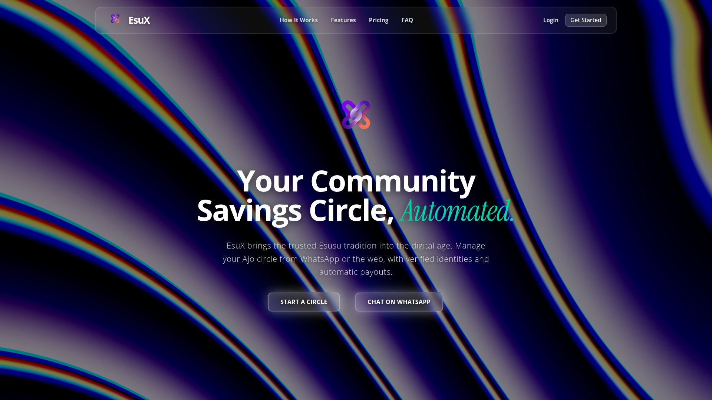
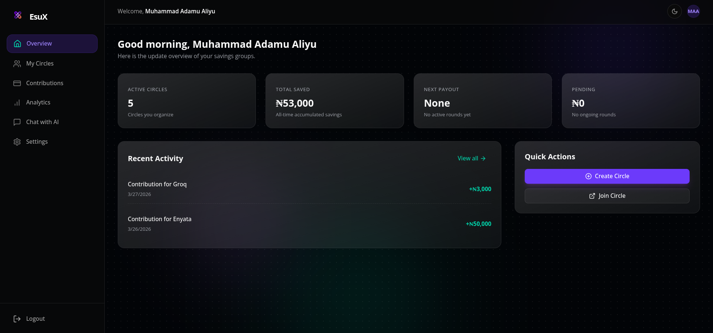
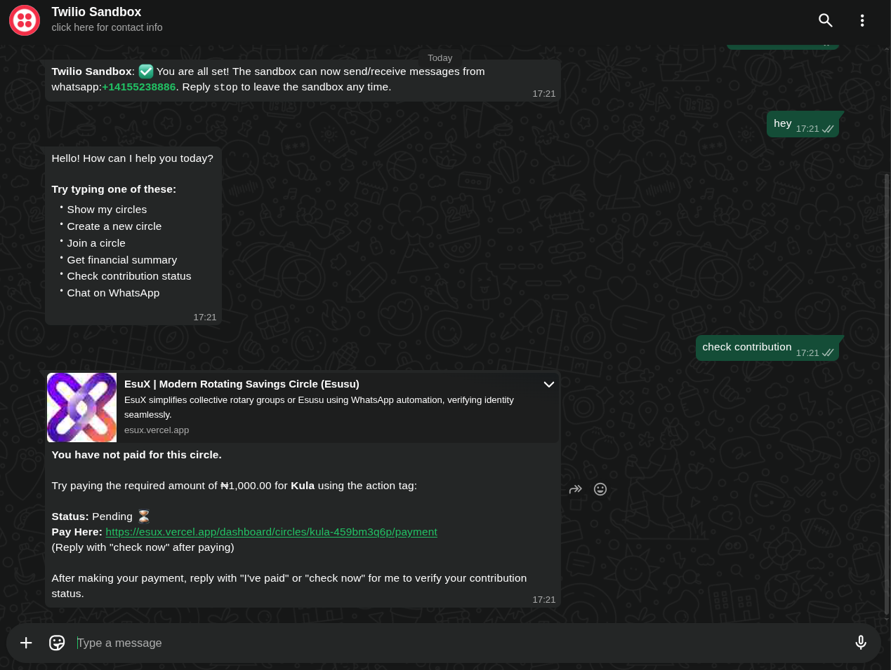

# 🚀 EsuX - The Smartest Way to Save Together

**Transforming the traditional Esusu / Ajo with Transparency, Trust, and AI.**

[Live Website](https://esux.vercel.app/) • [Technical Documentation](./TECHNICAL.md) • [WhatsApp Bot](https://wa.me/14155238886?text=join%20got-due)

**WhatsApp Number:** +1 (415) 523-8886  
**Sandbox Code:** `join got-due`

---

## 📖 Introduction: Why EsuX?

Traditional **Esusu** (also known as Ajo, Adashe, or Susu) is how millions of people across West Africa save money. It’s built on community, but it's often broken by **trust**.

- Someone misses a payment.
- The organizer has to chase everyone manually.
- Who gets the payout first?
- Where is the record of what I've paid?

**EsuX solves this.** We’ve taken the cultural beauty of rotating savings (ROSCA) and automated it with **Next.js**, **Interswitch**, and **Groq (Llama 3.1)**. By removing the manual treasurer and replacing them with a neutral, automated ledger, we eliminate the friction in community finance.

---

## ✨ Features that Make EsuX Different

### 🤖 1. The WhatsApp AI Agent
EsuX isn't just a bot; it's a financial agent that understands you. Unlike traditional apps, you interact with your money through natural conversation.

**What the AI can do NOW:**
- **Instant Circle Creation**: "Start a ₦10k monthly circle for office tea money."
- **Membership Management**: "List my circles" or "Tell me more about the Enyata circle."
- **Financial Status**: "How much have I saved in total?" 
- **Smart Contribution Checks**: "Have I paid for this month?" (The agent checks the ledger and provides a direct payment link if unpaid).
- **Holistic Overviews**: "What's my status across all circles?" (The agent prioritizes status by upcoming deadlines).

**Onboarding & Security:**
> [!CAUTION]
> **Registration Required**: To protect your funds, the WhatsApp Bot **cannot** interact with anonymous users. 
> 1. You **must** first register on the [Web Dashboard](https://esux.vercel.app/register).
> 2. You **must** verify your phone number.
> 3. The Bot uses your phone number as your **Unique Identity** to bridge your WhatsApp messages with your secure financial vault.

- **Powered by**: **Groq (Llama 3.1)** for industry-leading speed and reasoning.

### 💳 2. Secure & Verified Payments
Trust is built-in. We use **Interswitch** to:
- Verify every member using their **BVN**.
  - *Note: During the hackathon/demo phase (while our Interswitch business review is pending), BVN verification is set to **Auto-Verify**. Any 11-digit input will be accepted to allow you to explore all features.*
- Automate contributions through secure web checkout.
- Provide a clear, unchangeable digital ledger of every Kobo saved.

### 📊 3. Modern Web Dashboard
For those who want to see the "Big Picture":
- Beautiful analytics and contribution history.
- Management tools for circle organizers.
- Real-time notifications and payout scheduling.

---

## 🖼️ See EsuX in Action

| Landing Page | Dashboard Analytics | WhatsApp AI Bot |
| :---: | :---: | :---: |
|  |  |  |
| *Modern, Responsive UI* | *Real-time Data Visualization* | *Natural Language Savings* |

---

## 🔄 How the EsuX "Circle" Works

EsuX isn't for solo saving; it's for **growing together**. Here is the lifecycle of a typical savings circle:

1.  **The Assembly**: An organizer creates a circle (e.g., "Market Women Weekly") and sets the contribution amount (e.g., ₦10,000).
2.  **Invitation & Trust**: Members join via WhatsApp or Web. Every member must verify their identity (BVN) so the group knows everyone is a real person.
3.  **Consensus Governance**: If the group wants to change the amount or the circle name later, EsuX triggers a **Majority Vote**. No one person can change the rules without the group's consent.
4.  **The Rotation (Rounds)**:
    - In **Round 1**, every member pays their contribution.
    - The "Pot" (Total Collected) is disbursed to **Member #1**.
5.  **The Shift**:
    - In **Round 2**, everyone pays again.
    - The "Pot" is disbursed to **Member #2**.
6.  **Full Cycle**: The rounds continue until every member in the circle has received the pot once.

---

## 🚀 How to Get Started

1. **Sign Up**: Visit [esux.app](https://esux.vercel.app/) and create your profile.
2. **Verify Identity**: Connect your BVN (via Interswitch) to unlock all features.
3. **Start a Circle**: Set the amount, the timing, and invite your friends.
4. **Link WhatsApp**: Chat with the EsuX bot to manage your savings on the go.
5. **Save & Payout**: Contributions are automated, and payouts happen when it's your turn.

---

## 🛠️ The Power Behind the App

EsuX is built on a rock-solid foundation:
- **Frontend**: Next.js 15 (App Router), Tailwind CSS, Framer Motion.
- **Backend & Database**: Node.js, PostgreSQL (via Supabase), Drizzle ORM.
- **Identity & Payments**: Interswitch (BVN Full Details & Bills Payment).
- **Communication**: Twilio WhatsApp API & Groq (Llama 3.1).

---

## 🗺️ The EsuX Roadmap (Post-Hackathon)

We are just getting started. Here is what we're building next:
1. **Automated Disbursements**: Full integration with Interswitch's Payout API to send the "pot" to the winner instantly without manual approval.
2. **Proactive Nudges**: AI-initiated reminders that sound like a friend, not a robot, 24 hours before a deadline.
3. **Voice Updates**: Send a voice note to the bot to check your status while on the move.
4. **Group Chat Mode**: Add EsuX to your family WhatsApp group to act as the automated treasurer for everyone to see.
5. **Multi-Currency Support**: Expanding beyond the Naira to support rotating savings for the global diaspora.

> [!TIP]
> **Developing EsuX?** Check out our [Technical Documentation](./TECHNICAL.md) for a deep dive into the code.

---

## 📜 Team & Contribution

This project was built with ❤️ by:

- **Muhammad Adamu Aliyu** (@Adams-404)
  - Core Backend, Database Architect, WhatsApp AI Agent, Interswitch Integration.
- **Nasir Ibrahim Imam** (@IcedMist)
  - Frontend Engineering, UI/UX Design, State Management, App Logic.

---

## 📞 Get in Touch

Have questions or want to collaborate? Reach out to the project Lead at [muhammadadamualiyu33@gmail.com](mailto:muhammadadamualiyu33@gmail.com).

---
*Built for the Interswitch/Google AI Hackathon 2024.*
*EsuX - Savings, reimagined.*
