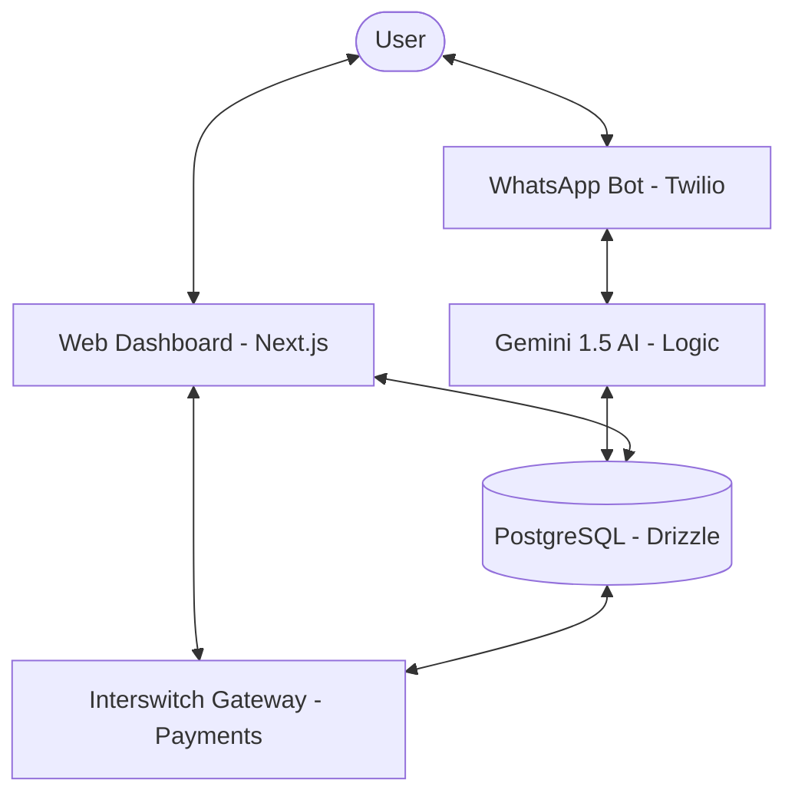

# 🏗️ EsuX - Technical Documentation

This document provides a deep dive into the architecture, technology stack, and implementation details of EsuX.

---

## ⚙️ Architecture Overview

EsuX is built as a multi-interface platform where the **Source of Truth** is a centralized PostgreSQL database managed by a Next.js backend. 

### System Architecture


Users can interact with the system through two main channels:
1.  **Web Dashboard**: A React-based interface for complex management and analytics.
2.  **WhatsApp AI Bot**: A natural language interface that handles the majority of day-to-day operations (contributions, status checks, reminders).

### The Flow of Data
- **Web/Mobile**: Next.js App Router -> Server Actions/API Routes -> Drizzle ORM -> PostgreSQL.
- **WhatsApp**: Twilio Webhook -> Next.js API Route -> Gemini AI (Natural Language Processing) -> Tool Calling -> Database -> WhatsApp Response.
- **Payments**: Frontend (Interswitch Web Checkout) -> Interswitch Gateway -> Webhook/Polling -> Database Update.

---

## 🛠️ Technology Stack

| Layer | Technology | Why we chose it |
| :--- | :--- | :--- |
| **Framework** | [Next.js 15](https://nextjs.org/) | App Router for modern API handling and fast frontend rendering. |
| **Language** | [TypeScript](https://www.typescriptlang.org/) | Type safety across the entire stack, from DB schema to API responses. |
| **Database** | [PostgreSQL](https://www.postgresql.org/) (via Supabase) | Relational data is perfect for ledgers and contribution tracking. |
| **ORM** | [Drizzle ORM](https://orm.drizzle.team/) | Lightweight, type-safe, and handles migrations flawlessly. |
| **AI Engine** | [Google Gemini 1.5](https://ai.google.dev/) | Multimodal capabilities and large context window for handling complex group savings logic. |
| **Messaging** | [Twilio WhatsApp API](https://www.twilio.com/whatsapp) | Reliable delivery and easy-to-use webhook system. |
| **Payments** | [Interswitch](https://www.interswitchgroup.com/) | Robust infrastructure for Nigerian financial transactions and KYC (BVN). |
| **Styling** | [Tailwind CSS](https://tailwindcss.com/) + [shadcn/ui](https://ui.shadcn.com/) | Rapid UI development with a premium, consistent look. |

---

## 💳 Payment & Identity Logic

### Identity Verification (KYC)
Trust is the foundation of EsuX. We use the **Interswitch BVN Full Details API** to ensure that:
1. Every member is a real person.
2. The name on the savings circle matches the name on the bank account.
3. Ghost members are eliminated from the start.

### The "Virtual Ledger" System
While all funds are settled into a single Interswitch Merchant account, EsuX maintains a **Digital Ledger** to separate funds:
- **Circles Table**: Defines the "rules" (amount, frequency).
- **Rounds Table**: Tracks the current active cycle within a circle.
- **Contributions Table**: Records every specific payment linked to a `memberId` and `roundId`.

This ensures that even with one pool of physical cash, we know exactly who owns every Kobo.

---

## 🤖 WhatsApp Bot Implementation

The bot isn't just a simple responder; it's an **Agent**.

1. **Input**: A user sends a message like *"I want to pay for my Monday circle"*.
2. **Context**: The system identifies the user by their phone number and retrieves their active circles.
3. **Reasoning**: Gemini AI analyzes the intent and decides it needs to call a "tool" (e.g., `getCircleDetails`).
4. **Action**: The tool queries the database and returns the current status.
5. **Output**: Gemini formats a friendly response: *"You're all set! I've found your Monday circle. The contribution is ₦5,000. Here is your unique payment link..."*

---

## 🚀 Local Development

To run EsuX locally, follow these steps:

### 1. Clone & Install
```bash
git clone https://github.com/Adams-404/delta-77.git
cd delta-77
npm install
```

### 2. Environment Variables
Create a `.env` file based on `.env.example`. You will need:
- `DATABASE_URL`: Your PostgreSQL connection string.
- `GEMINI_API_KEY`: For the AI bot.
- `TWILIO_ACCOUNT_SID` / `AUTH_TOKEN`: For WhatsApp messaging.
- `INTERSWITCH_CLIENT_ID` / `SECRET`: For payments.

### 3. Database Migration
```bash
npx drizzle-kit push
```

### 4. Start the Dev Server
```bash
npm run dev
```

---

## 🔒 Security Measures
- **Data Encryption**: Sensitive user data is encrypted at rest.
- **Webhook Validation**: All incoming requests from Twilio and Interswitch are validated using HMAC signatures.
- **Rate Limiting**: API routes are protected against brute-force attacks.

---
*Maintained by the EsuX Engineering Team.*
