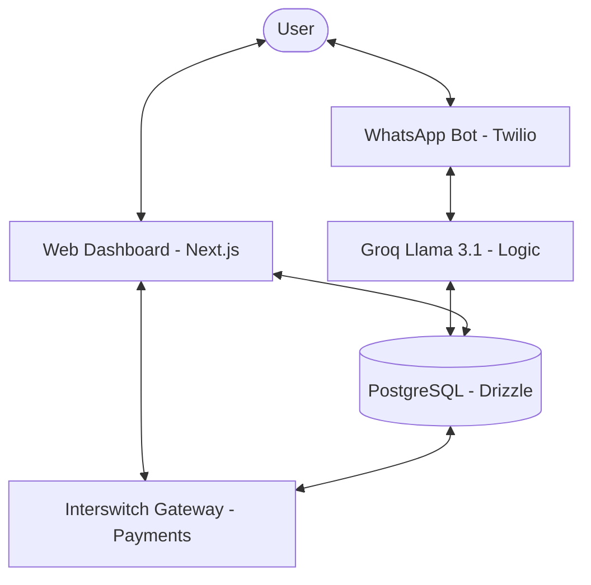

# 🏗️ EsuX - Technical Documentation

This document provides a deep dive into the architecture, technology stack, and implementation details of EsuX.

---

## ⚙️ Architecture Overview

EsuX is built as a multi-interface platform where the **Source of Truth** is a centralized PostgreSQL database managed by a Next.js backend. 

### System Architecture


Users can interact with the system through two main channels:
1.  **Web Dashboard**: A React-based interface for complex management and analytics.
2.  **WhatsApp AI Bot**: A natural language interface that handles the majority of day-to-day operations (contributions, status checks, reminders).

### The Flow of Data
- **Web/Mobile**: Next.js App Router -> Server Actions/API Routes -> Drizzle ORM -> PostgreSQL.
- **WhatsApp**: Twilio Webhook -> Next.js API Route -> Groq (Llama 3.1) -> Tool Calling -> Database -> WhatsApp Response.
- **Payments**: Frontend (Interswitch Web Checkout) -> Interswitch Gateway -> Webhook/Polling -> Database Update.

---

## 🛠️ Technology Stack

| Layer | Technology | Why we chose it |
| :--- | :--- | :--- |
| **Framework** | [Next.js 15](https://nextjs.org/) | App Router for modern API handling and fast frontend rendering. |
| **Language** | [TypeScript](https://www.typescriptlang.org/) | Type safety across the entire stack, from DB schema to API responses. |
| **Database** | [PostgreSQL](https://www.postgresql.org/) (via Supabase) | Relational data is perfect for ledgers and contribution tracking. |
| **ORM** | [Drizzle ORM](https://orm.drizzle.team/) | Lightweight, type-safe, and handles migrations flawlessly. |
| **AI Engine** | [Groq (Llama 3.1)](https://groq.com/) | Extremely low latency and high accuracy for rapid WhatsApp interactions. |
| **Messaging** | [Twilio WhatsApp API](https://www.twilio.com/whatsapp) | Reliable delivery and easy-to-use webhook system. |
| **Payments** | [Interswitch](https://www.interswitchgroup.com/) | Robust infrastructure for Nigerian financial transactions and KYC (BVN). |
| **Styling** | [Tailwind CSS](https://tailwindcss.com/) + [shadcn/ui](https://ui.shadcn.com/) | Rapid UI development with a premium, consistent look. |

---

## 💳 Payment & Identity Logic

### Identity Verification (KYC)
Trust is the foundation of EsuX. We use the **Interswitch BVN Full Details API** to verify members.

> [!IMPORTANT]
> **Auto-Verify Mode (Hackathon/Demo)**: Our Interswitch merchant account is currently in the "Pending Review" state. To ensure the judging team can test the full application flow (including restricted payment features), we have implemented an **Auto-Verify** logic:
> - Any 11-digit BVN input is accepted.
> - The application bypasses the Interswitch API call for identity and proceeds as "Verified".

### The "Virtual Ledger" System
While all funds are settled into a single Interswitch Merchant account, EsuX maintains a **Digital Ledger** to separate funds:
- **Circles Table**: Defines the "rules" (amount, frequency).
- **Rounds Table**: Tracks the current active cycle within a circle.
- **Contributions Table**: Records every specific payment linked to a `memberId` and `roundId`.

This ensures that even with one pool of physical cash, we know exactly who owns every Kobo.

---

### AI Agent Tool-Set (The Logic Engine)
In our agentic implementation, Groq (Llama 3.1) doesn't just "chat" — it executes backend tasks through a set of **Functional Tools**. These include:

| Tool Name | Frontend Role | Backend Logic |
| :--- | :--- | :--- |
| `create_circle` | Initiates setup | Uses `createCircleCore` action to define a new Esusu circle in the database. |
| `list_my_circles` | Displays status | Fetches active memberships for the user derived from their phone number. |
| `get_circle_details` | In-depth info | Retrieves specific round status, members, and upcoming payouts. |
| `check_contribution_status` | Status & Payouts | Analyzes current ongoing round and generates contextual payment links. |
| `get_financial_summary` | Aggregate Data | Summarizes total contributions and participation count for the user. |

### Identity Linkage: Bridging WhatsApp and the Web
One of the core challenges was ensuring that a user on WhatsApp is the same user on our dashboard.
- **The Bridge**: We use the **International Format Phone Number** as a unique ID.
- **Verification**: On first sign-up (Web), users verify their phone number. 
- **Tool Context**: When a message enters via Twilio, our agent queries the DB for a user linked to that sender's phone number. If no link is found, the agent **proactively requests registration** to maintain security.

---

## 🚀 Local Development

To run EsuX locally, follow these steps:

### 1. Clone & Install
```bash
git clone https://github.com/Adams-404/delta-77.git
cd delta-77
npm install
```

### 2. Environment Variables
Create a `.env` file based on `.env.example`. You will need:
- `DATABASE_URL`: Your PostgreSQL connection string.
- `GROQ_API_KEY`: For the AI bot.
- `TWILIO_ACCOUNT_SID` / `AUTH_TOKEN`: For WhatsApp messaging.
- `INTERSWITCH_CLIENT_ID` / `SECRET`: For payments.

### 3. Database Migration
```bash
npx drizzle-kit push
```

### 4. Start the Dev Server
```bash
npm run dev
```

---

## 🔒 Security & Privacy

### 1. Data Protection
- **BVN (Bank Verification Number)**: We follow industry-standard compliance. BVNs are used for identity verification via Interswitch and **NEVER** stored in our database. We only store an encrypted `bvnHash` for record-keeping.
- **Data at Rest**: All sensitive information is encrypted at rest within our production environment.

### 2. Transaction Integrity
- **Webhook HMAC Validation**: Secure verification is enabled for all payment callbacks to prevent "transaction spoofing".
- **AI Link Scrubbing**: Our agent is strictly configured to **NEVER** send external payment links. It only recognizes the official application domain, preventing "phishing via bot" attacks.

---
*Maintained by the EsuX Engineering Team.*
